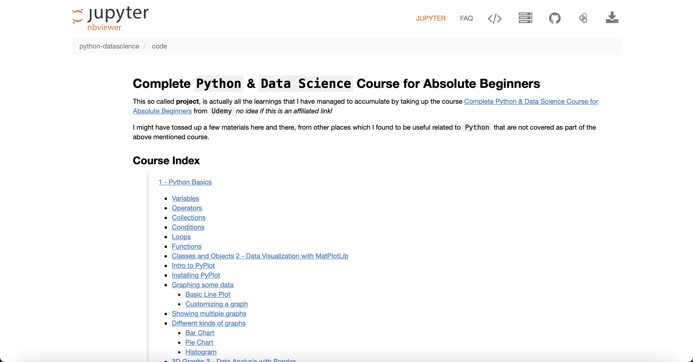
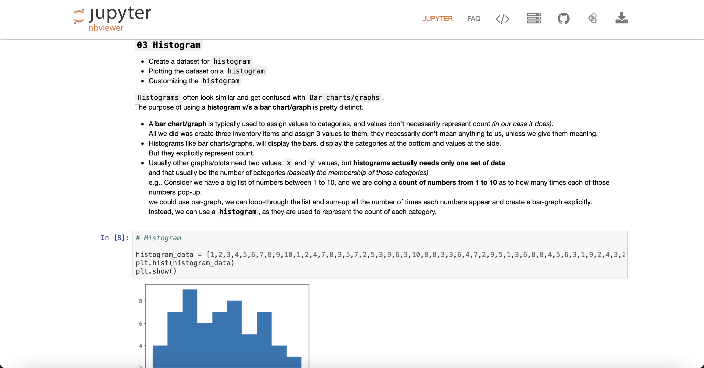

# python-datascience

repo for maintaining all the learning materials created from taking up the Udemy course - https://www.udemy.com/share/105SgA3@jI016OcdF_0R0lxYJT6TEdh_AYDGo_bcYlUkUmb1PeZ0qo5aF_OTZuTwInR99EoM/

# Complete `Python` & `Data Science` Course for Absolute Beginners

This so called **project**, is actually all the learnings that I have managed to accumulate by taking up the course [Complete Python & Data Science Course for Absolute Beginners](https://www.udemy.com/share/105SgA3@b-b-i62y90RM-qVQ1oFaGTDOzAIVgeitblk8UJn4046Yj2Jh4zAiMDznhiZyy9kp/) from `Udemy` _no idea if this is an affiliated link!_

I might have tossed up a few materials here and there, from other places which I found to be useful related to `Python` that are not covered as part of the above mentioned course.

## Access this REPO in **Jupyter Notebook** Style

[nbviewer.org GouthamShiv/python-datascience](https://nbviewer.org/github/GouthamShiv/python-datascience/blob/master/code/index.ipynb)

## Course Index

> **[1 - Python Basics](./code/01-python-fundamentals/00-index.ipynb)**

-   [Variables](./code/01-python-fundamentals/01-variables.ipynb)
-   [Operators](./code/01-python-fundamentals/02-operators.ipynb)
-   [Collections](./code/01-python-fundamentals/03-collections.ipynb)
-   [Conditions](./code/01-python-fundamentals/04-conditions.ipynb)
-   [Loops](./code/01-python-fundamentals/05-loops.ipynb)
-   [Functions](./code/01-python-fundamentals/06-functions.ipynb)
-   [Classes and Objects](./code/01-python-fundamentals/07-classes-and-objects.ipynb)

> **[2 - Data Visualization with MatPlotLib](./code/02-data-visualization-with-python-and-matplotlib/00-index.ipynb)**

-   [Intro to PyPlot](./code/02-data-visualization-with-python-and-matplotlib/01-intro-to-pyplot.ipynb)
-   [Installing PyPlot](./code/02-data-visualization-with-python-and-matplotlib/02-installing-pyplot.ipynb)
-   [Graphing some data](./code/02-data-visualization-with-python-and-matplotlib/03-graphing-data.ipynb)
    -   [Basic Line Plot](./code/02-data-visualization-with-python-and-matplotlib/03-graphing-data.ipynb)
    -   [Customizing a graph](./code/02-data-visualization-with-python-and-matplotlib/03-graphing-data.ipynb)
-   [Showing multiple graphs](./code/02-data-visualization-with-python-and-matplotlib/04-multiple-graphs.ipynb)
-   [Different kinds of graphs](./code/02-data-visualization-with-python-and-matplotlib/05-different-kinds-of-graphs.ipynb)
    -   [Bar Chart](./code/02-data-visualization-with-python-and-matplotlib/05-different-kinds-of-graphs.ipynb)
    -   [Pie Chart](./code/02-data-visualization-with-python-and-matplotlib/05-different-kinds-of-graphs.ipynb)
    -   [Histogram](./code/02-data-visualization-with-python-and-matplotlib/05-different-kinds-of-graphs.ipynb)
-   [3D Graphs](./code/02-data-visualization-with-python-and-matplotlib/06-3d-graphs.ipynb)

> **[3 - Data Analysis with Pandas](./code/03-data-analysis-with-pandas/00-index.ipynb)**

-   [Intro to Pandas](./code/03-data-analysis-with-pandas/01-intro-to-pandas.ipynb)
    -   [What is Pandas?](./code/03-data-analysis-with-pandas/01-intro-to-pandas.ipynb)
    -   [Pandas Data Structures](./code/03-data-analysis-with-pandas/01-intro-to-pandas.ipynb)
    -   [What are some of the applications of Pandas?](./code/03-data-analysis-with-pandas/01-intro-to-pandas.ipynb)
    -   [Why learn Pandas?](./code/03-data-analysis-with-pandas/01-intro-to-pandas.ipynb)
-   [Installing and importing Pandas](./code/03-data-analysis-with-pandas/02-installing-pandas.ipynb)
-   [Creating Pandas Series](./code/03-data-analysis-with-pandas/03-pandas-series.ipynb)
    -   [Creating Pandas Series - With list](./code/03-data-analysis-with-pandas/03A-pandas-series-with-list.ipynb)
    -   [Creating Pandas Series - With dictionary](./code/03-data-analysis-with-pandas/03B-pandas-series-with-dictionary.ipynb)
    -   [Creating Pandas Series - with NumPy arrays](./code/03-data-analysis-with-pandas/03C-pandas-series-with-numpy-arrays.ipynb)
    -   [Creating Pandas Series - Date Ranges](./code/03-data-analysis-with-pandas/03C-pandas-series-with-numpy-arrays.ipynb)
-   [Getting elements from Series](./code/03-data-analysis-with-pandas/04-getting-elements-from-series.ipynb)
-   [Getting properties from Series](./code/03-data-analysis-with-pandas/05-getting-properties-from-series.ipynb)
-   [Modifying Series](./code/03-data-analysis-with-pandas/06-pandas-series-modification.ipynb)
-   [Series operations](./code/03-data-analysis-with-pandas/07-pandas-series-operations.ipynb)
-   [Series comparisons and iteration](./code/03-data-analysis-with-pandas/08-compare-and-iterate-series.ipynb)
-   [Creating Pandas DataFrames](./code/03-data-analysis-with-pandas/09-pandas-dataframes.ipynb)
    -   [Creating DataFrames from Python lists](./code/03-data-analysis-with-pandas/09A-dataframes-from-lists.ipynb)
    -   [Creating DataFrames from Dictionaries](./code/03-data-analysis-with-pandas/09B-dataframes-from-dictionary.ipynb)
    -   [Creating DataFrames from Pandas Series](./code/03-data-analysis-with-pandas/09C-dataframes-with-series.ipynb)
-   [Getting elements from DataFrames](./code/03-data-analysis-with-pandas/10-getting-dataframe-elements.ipynb)
    -   [Getting DataFrames elements based on columns](./10A-column-elements-from-dataframe.ipynb)
    -   [Getting DataFrames elements based on rows](./code/03-data-analysis-with-pandas/10B-row-elements-from-dataframe.ipynb)
    -   [Getting individual elements from DataFrames](./code/03-data-analysis-with-pandas/10C-getting-individual-elements-dataframes.ipynb)
    -   [Slicing DataFrame columns and rows](./code/03-data-analysis-with-pandas/10D-slicing-dataframes.ipynb)
    -   [Getting DataFrame elements based on booleans](./code/03-data-analysis-with-pandas/10E-dataframe-elements-basedon-boolean.ipynb)
-   [Getting properties from DataFrames](./code/03-data-analysis-with-pandas/11-dataframe-properties.ipynb)
-   [Modifying DataFrames](./code/03-data-analysis-with-pandas/12-dataframe-modification.ipynb)
-   [DataFrames operations](./code/03-data-analysis-with-pandas/13-dataframe-operations.ipynb)
-   [DataFrames comparisons and iteration](./code/03-data-analysis-with-pandas/14-dataframe-comparisons-and-iterations.ipynb)
-   [Reading CSVs into DataFrames](./code/03-data-analysis-with-pandas/15-reading-csv-into-dataframe.ipynb)

> **[4 - Data Mining with Python](./code/04-python-data-mining/00-index.ipynb)**

-   [**`Data Wrangling`**](./code/04-python-data-mining/00-index.ipynb)
    -   [Cleaning Data](./code/04-python-data-mining/01-cleaning-data.ipynb)
        -   Filtering out noise
        -   Making data available for analysis
    -   [Statistics](./code/04-python-data-mining/01-cleaning-data.ipynb)
        -   Simple Statistics
    -   [Practical example of **data mining**](./code/04-python-data-mining/02-practical-datamining-example.ipynb)
    -   [Dataset Examples](./code/04-python-data-mining/02-practical-datamining-example.ipynb)
-   [**`Data Mining Fundamentals`**](./code/04-python-data-mining/00-index.ipynb)
    -   [Cluster Analysis](./code/04-python-data-mining/03A-cluster-analysis.ipynb)
    -   [Classification and Regression](./code/04-python-data-mining/03B-classification-and-regression.ipynb)
        -   **LinearRegression** and **LogisticRegression**
        -   **Support Vector Classifier** and **Support Vector Regressor**
        -   **KNeighborsClassifier** and **KNeighborsRegressor**
    -   [Association and Correlation](./code/04-python-data-mining/03C-association-and-correlation.ipynb)
    -   [Dimensionality Reduction](./code/04-python-data-mining/03D-dimensionality-reduction.ipynb)

> **[5 - Big Data with Apache Spark](./code/05-big-data-with-spark/00-index.ipynb)**

-   [Apache Spark - Framework Overview](./code/05-big-data-with-spark/01-spark-overview.ipynb)
-   [Apache Spark - Key Functions](./code/05-big-data-with-spark/02-spark-key-functions.ipynb)
-   [Apache Spark - Machine Learning](./code/05-big-data-with-spark/03-spark-ml-intro.ipynb)
-   [Examples - Using Machine Learning Pipelines](./code/05-big-data-with-spark/03-spark-ml-intro.ipynb)

> **[6 - Mining and Storing Data](./code/06-mining-and-storing-data/00-index.ipynb)**

-   [Text Mining](./code/06-mining-and-storing-data/01-text-mining.ipynb)
-   [Network Mining](./code/06-mining-and-storing-data/02-network-mining.ipynb)
-   [Python Matrix library](./code/06-mining-and-storing-data/03-matrix-mining.ipynb)
-   [Mining a SQL-database](./code/06-mining-and-storing-data/04-sql-mining.ipynb)

> **[7 - Natural Language Processing](./code/07-natural-language-processing/00-index.ipynb)**

-   [NLP Data Cleaning](./code/07-natural-language-processing/01-nlp-data-cleaning.ipynb)
-   [Count Vectorizer, TFIDF](./code/07-natural-language-processing/02-count-vectorization-and-tfidf.ipynb)
-   [NLP Example with Spam](./code/07-natural-language-processing/03-nlp-example-with-spam.ipynb)
-   [Tweak model with Spam data](./code/07-natural-language-processing/04-tweak-nlp-model.ipynb)

---

[next](./code/01-python-fundamentals/00-index.ipynb)
